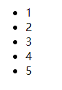
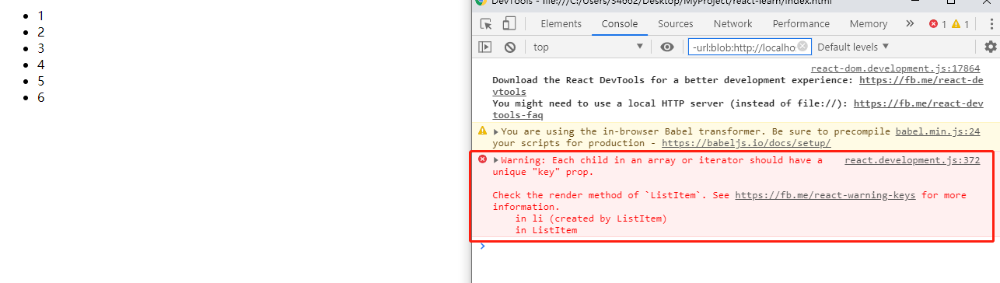

# React学习笔记

[toc]

## 一、核心概念

### 1.1 State

1. State更新有可能会是异步的
因为this.props和this.state可能会是异步更新，所以不要依赖他们的值去更新下一个状态：

    ```js
    // 这是不对的，因为props和state可能是异步更新
    this.setState({
        counter: this.state.counter + this.props.increment,
    });
    ```

    解决这个问题的方法是**让setState函数接受一个函数作为参数，而不是一个对象**

    ```js
    // 函数内返回一个对象
    this.setState((state, props) => ({
        counter: state.counter + props.increment
    }));
    ```

2. 数据是向下流动的
子组件是不知道父组件传过来的属性（props）到底在父组件中是props还是state还是手工输入的。这通常称为**单向数据流**。任何state只属于特定组件，从state派生出去的数据只会影响到当前组件及其子组件。

### 1.2 事件处理

React元素事件处理和DOM元素很相似，只是语法上有两处不同：

- React事件属性采用小驼峰写法
- 事件属性中接受的是函数，而不是函数执行，并且包裹在{}中

```js
// DOM
<button onclick="activateLasers()">
    Activate Lasers
</button>
```

```js
// React，这里特别要注意传入的是函数，而不是函数执行！！！
<button onClick={activateLasers}>
    Activate Lasers
</button>
```

1. 事件阻止
在DOM和React中事件阻止分别如下：

    ```html
    <!-- 通过在事件函数中最后return false实现事件阻止 -->
    <a href="https://www.baidu.com" onclick="console.log('The link was clicked'); return false">
        Click me
    </a>
    ```

    ```js
    // e是一个合成事件，通过e.preventDefault()来阻止事件
    function ActiveLink() {
        function handleClick(e) {
            e.preventDefault();
            console.log('The link was clicked.');
        }

        return (
            <a href="https://www.baidu.com" onClick={handleClick}>
                Click me
            </a>
        );
    }
    ```

2. 事件函数this指向问题

    - 使用function定义的函数

    ```js
    constructor() {
        ...
        // 常规定义的函数必须加上this指向的绑定
        this.handleClick = this.handleClick.bind(this);
    }

    handleClick() {
        ...
    }

    render() {
        return(
            // 构造器中绑定了this之后，
            //这里才可以调用this.handleClick找到“类”中的handleClick方法
            <button onClick={this.handleClick}>
                ...
            </button>
        );
    }
    ```

    - 使用“类箭头”(class fields语法)函数的写法

    ```js
    handleClick = () => {
        ...
    }
    ```

    - 不绑定、不写“类箭头”函数<font color='red'>（不推荐）</font>

    ```js
    handleClick(){
        ...
    }

    render() {
        return (
            // 在调用时使用箭头函数调用，
            // 使得箭头函数中的this与上下文（render函数）所在的词法环境相同
            // 如果回调函数（handleClick）传到子组件，会造成额外的重新渲染
            <button onClick={() => this.handleClick()}>
                ...
            </button>
        );
    }
    ```

3. 向事件处理函数传递参数

    有两种方式（不管函数是如何形式定义的）：

    ```html
    <!-- 如果在回调函数中用的到事件对象，对于箭头函数来说，必须显式传递e
    而对于bind方式传值，事件对象e隐式传到回调函数中 -->
    <button onClick={(e) => this.deleteRow(id, e)}>Delete Row</button>
    <button onClick={this.deleteRow.bind(this, id)}>Delete Row</button>
    ```

### 1.3 条件渲染

React中条件渲染和js中一样，使用if或者条件运算符（?:）。还可以使用&&，true&&expression返回expression，而false&&expression会返回false。
一个条件渲染如下：

```js
<div>
    {isLogin
        ? <LoginButton onClick={} />
        : <LoginButton onClick={} />
    }
</div>
```

下面的例子演示一个WaringBanner组件，根据父组件传来的props进行条件渲染：

```js
function WaringBanner(props){
    if(!props.warn){
        // 这里可以返回一个空视图，
        // 这里return出去后不执行下面的return了（和js一样）
        return null;
    }

    return (
        <div>
            Waring
        </div>
    );
}


class Page extends React.Component {
    constructor(props){
        super(props);
        this.state = {showWaring: true};
    }

    render() {
        return (
            <div>
                <WaringBanner warn={this.state.showWaring} />
            </div>
        );
    }
}
```

### 1.4 列表 & Key

可以通过jsx的语法渲染列表：

```jsx
const numbers = [1,2,3,4,5];
const listItems = numbers.map((item) =>
    <li>{item}</li>
);

ReactDOM.render(
    <ul>{listItems}</ul>,
    document.getElementById('root')
);
```



一般情况下，需要将最后呈现的元素封装为一个组件：

```js
function ListItems(props){
    const listItems = props.numbers.map((item) =>
        <li>{item}</li>
    )
    return (
        <ul>{listItems}</ul>
    );
}

ReactDOM.render(
    <ListItems numbers={numbers} />,
    document.getElementById('root')
);
```

如果单单这么写，在页面上显示没有问题，但是打开控制台，会发现报错：


<font color='red'>Key帮助React识别哪些元素改变了，进而使DOM只修改改变的部分，加快渲染速度。如果不设置key，在页面元素改变之后，DOM寻找不同的效率就会变低。</font>
&emsp;&emsp;一个key一般设置一个字符串，并且**这个字符串在列表中是唯一的**

```js
// 使用数据中传来的id作为key
const todoItems = todos.map((todo) =>
    <li key={todo.id}>
        {todo.text}
    </li>
)
// 万不得已的时候，使用数据索引作为id，其实这就是React
// 默认指定key的方式
const todoItems = todos.map((todo, index) =>
    <li key={index}>
        {todo.text}
    </li>
)

// 在列表项目顺序可能发生改变的时候，如果使用
// index作为key，会使得性能变差，还会引起组件状态问题
```

Key的总结：

- key只会传递给React，不会传递给子组件
- key只需要在当前数组中唯一即可，而不需要在整个组件内唯一
- key一般都设置在map方法内的数组元素上

### 1.5 表单

通常表单需要与用户交流的输入框。在react中，通常需要在提交时获取输入的内容，这就用到了**受控组件**。

#### 1.5.1 受控组件

html中表单输入组件（如input、textarea、select）会自己维护一个state，并根据用户输入进行更新。在React中，通过state属性，并且setState()来更新。如果在react中使用html元素，就需要统一状态，将react中的state作为唯一接收用户输入的属性。被react以这种方式控制的表单输入元素称为**受控元素**

```js
class NameForm extends React.Component {
    constructor(props){
        super(props);
        this.state = {value: ''};
    }

    handleChange = (event) => {
        // 通过默认传入的合成事件获取事件目标的value值
        // 详情查看MDN的Event API
        this.setState({value: event.target.value});
    }

    handleSubmit = (event) => {
        alert('提交的名字：' + this.state.value);
        // 阻止表单提交后的页面跳转事件等
        event.preventDefault();
    }

    render() {
        return (
            <form onSubmit={this.handleSubmit}>
                <label>
                    名字：
                    <input
                        type="name"
                        value={this.state.value}
                        onChange={this.handleChange}
                    />
                </label>
                <input type="submit" value="提交"/>
            </form>
        );
    }
}
```

#### 1.5.2 textarea标签

HTML中，textarea通过其子元素定义其文本：

```html
<!-- 开头和末尾标签都不能省略，这点和React不同 -->
<textarea>some Text</textarea>
```

而在React中，和input一样，也通过state去获取对应的value属性：

```js
class TextArea extends React.Component{
    constructor(props){
        super(props);
        this.state = {
            value: 'Some text'
        }
    }

    handleChange = (event) => {
        this.setState({
            value: event.target.value
        })
    }

    handleSubmit = (event) => {
        ...
    }

    render() {
        return (
            <form onSubmit={this.handleSubmit}>
                ...
                <textarea value={this.state.value}
                    onChange={this.handleChange} />
                ...
            </form>
        );
    }
}
```

#### 1.5.3 select标签


### 1.6 状态提升

### 1.7 组合 vs 继承

### 1.8 React哲学


## 二、高级指引

## 三、API相关

## 四、Hook
